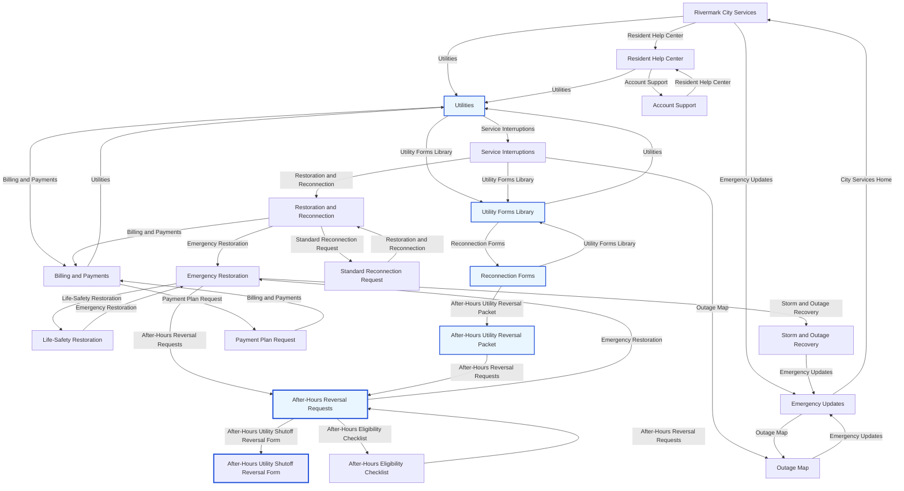

# Trajectory: heuristic / adversarial

- Score: `0.990`
- Path: `city_home -> utilities -> utility_forms_library -> reconnection_forms -> after_hours_reversal_packet -> after_hours_reversal_requests -> after_hours_shutoff_reversal_form`

