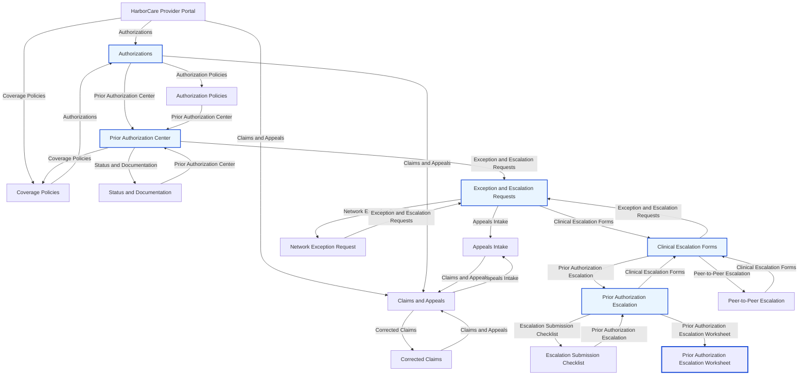

# Trajectory: heuristic / expert

- Score: `0.990`
- Path: `provider_home -> authorizations -> prior_authorization_center -> exception_escalation_requests -> clinical_escalation_forms -> prior_auth_escalation -> prior_auth_escalation_worksheet`

