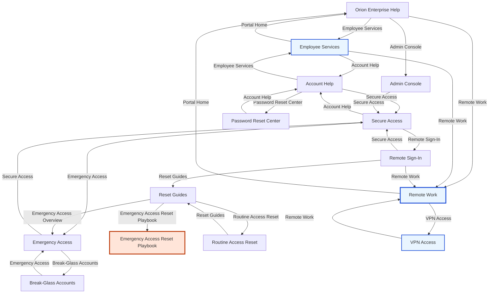

# Trajectory: heuristic / hard

- Score: `0.010`
- Path: `dashboard -> employee_services -> remote_work -> vpn_access -> remote_work -> vpn_access -> remote_work -> vpn_access -> remote_work`

```mermaid
graph TD
    node_dashboard["Orion Enterprise Help"]
    class node_dashboard start,visited
    node_dashboard -->|"Employee Services"| node_employee_services:::pathEdge
    node_dashboard -->|"Remote Work"| node_remote_work
    node_dashboard -->|"Admin Console"| node_admin_console
    node_employee_services["Employee Services"]
    class node_employee_services visited
    node_employee_services -->|"Account Help"| node_account_help
    node_employee_services -->|"Remote Work"| node_remote_work:::pathEdge
    node_employee_services -->|"Portal Home"| node_dashboard
    node_account_help["Account Help"]
    node_account_help -->|"Secure Access"| node_secure_access
    node_account_help -->|"Password Reset Center"| node_password_reset_center
    node_account_help -->|"Employee Services"| node_employee_services
    node_secure_access["Secure Access"]
    node_secure_access -->|"Remote Sign-In"| node_remote_signin
    node_secure_access -->|"Emergency Access"| node_emergency_access
    node_secure_access -->|"Account Help"| node_account_help
    node_remote_signin["Remote Sign-In"]
    node_remote_signin -->|"Reset Guides"| node_reset_guides
    node_remote_signin -->|"Secure Access"| node_secure_access
    node_remote_signin -->|"Remote Work"| node_remote_work
    node_reset_guides["Reset Guides"]
    node_reset_guides -->|"Emergency Access Reset Playbook"| node_emergency_access_reset_playbook
    node_reset_guides -->|"Routine Access Reset"| node_routine_access_reset
    node_reset_guides -->|"Emergency Access Overview"| node_emergency_access
    node_emergency_access["Emergency Access"]
    node_emergency_access -->|"Break-Glass Accounts"| node_break_glass_accounts
    node_emergency_access -->|"Secure Access"| node_secure_access
    node_password_reset_center["Password Reset Center"]
    node_password_reset_center -->|"Account Help"| node_account_help
    node_remote_work["Remote Work"]
    class node_remote_work visited
    node_remote_work -->|"VPN Access"| node_vpn_access:::pathEdge
    node_remote_work -->|"Portal Home"| node_dashboard
    node_admin_console["Admin Console"]
    node_admin_console -->|"Secure Access"| node_secure_access
    node_vpn_access["VPN Access"]
    class node_vpn_access visited
    node_vpn_access -->|"Remote Work"| node_remote_work:::pathEdge
    node_break_glass_accounts["Break-Glass Accounts"]
    node_break_glass_accounts -->|"Emergency Access"| node_emergency_access
    node_routine_access_reset["Routine Access Reset"]
    node_routine_access_reset -->|"Reset Guides"| node_reset_guides
    node_emergency_access_reset_playbook["Emergency Access Reset Playbook"]
    class node_emergency_access_reset_playbook target
    classDef start fill:#d8f3dc,stroke:#2d6a4f,stroke-width:2px;
    classDef target fill:#ffe5d9,stroke:#bc3908,stroke-width:3px;
    classDef visited fill:#e9f5ff,stroke:#1d4ed8,stroke-width:2px;
    classDef pathEdge stroke:#1d4ed8,stroke-width:3px;
```
