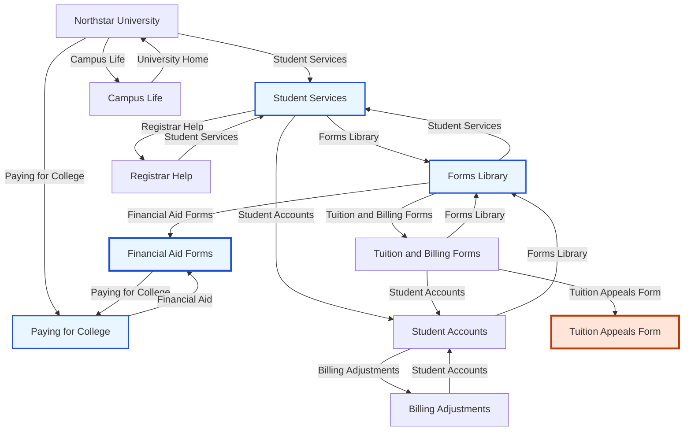

# Trajectory: heuristic / medium

- Score: `0.010`
- Path: `landing -> student_services -> forms_library -> financial_aid_forms -> paying_for_college -> financial_aid_forms -> paying_for_college -> financial_aid_forms -> paying_for_college`

