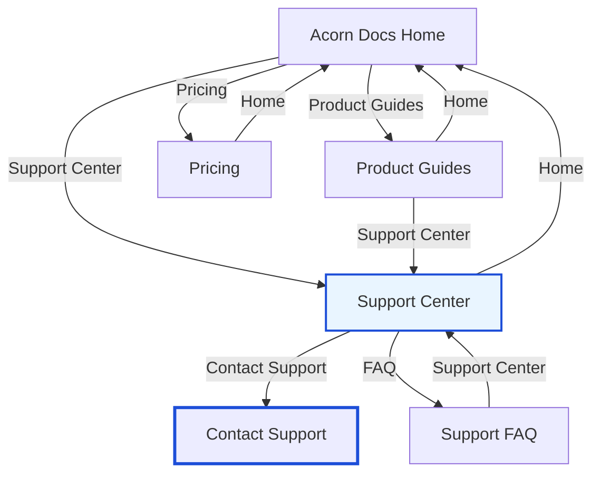

# Trajectory: oracle / easy

- Score: `0.990`
- Path: `home -> support_center -> contact_support`

```mermaid
graph TD
    node_home["Acorn Docs Home"]
    class node_home start,visited
    node_home -->|"Product Guides"| node_product_guides
    node_home -->|"Support Center"| node_support_center:::pathEdge
    node_home -->|"Pricing"| node_pricing
    node_product_guides["Product Guides"]
    node_product_guides -->|"Home"| node_home
    node_product_guides -->|"Support Center"| node_support_center
    node_support_center["Support Center"]
    class node_support_center visited
    node_support_center -->|"Contact Support"| node_contact_support:::pathEdge
    node_support_center -->|"FAQ"| node_faq
    node_support_center -->|"Home"| node_home
    node_pricing["Pricing"]
    node_pricing -->|"Home"| node_home
    node_faq["Support FAQ"]
    node_faq -->|"Support Center"| node_support_center
    node_contact_support["Contact Support"]
    class node_contact_support target,visited
    classDef start fill:#d8f3dc,stroke:#2d6a4f,stroke-width:2px;
    classDef target fill:#ffe5d9,stroke:#bc3908,stroke-width:3px;
    classDef visited fill:#e9f5ff,stroke:#1d4ed8,stroke-width:2px;
    classDef pathEdge stroke:#1d4ed8,stroke-width:3px;
```
